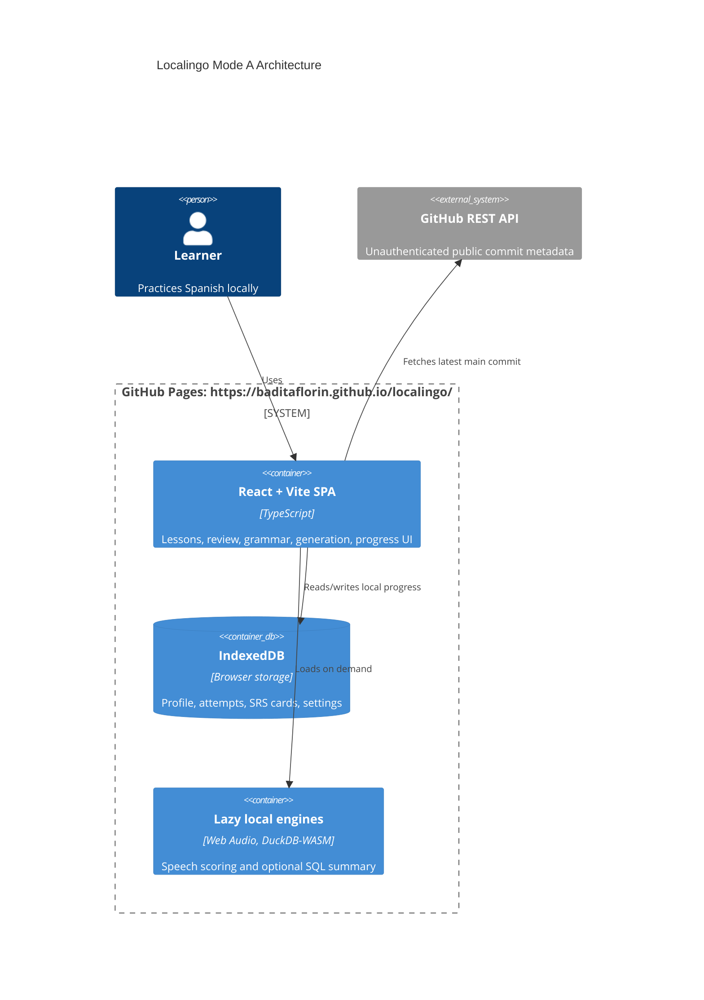

# localingo


Live site:
https://baditaflorin.github.io/localingo/

Repository:
https://github.com/baditaflorin/localingo

Support:
https://www.paypal.com/paypalme/florinbadita

Localingo is a private, gamified language tutor with lessons, spaced repetition, speech scoring, grammar feedback, generated drills, local progress storage, shareable state links, and a lazy DuckDB-WASM analytics lab. It is a pure GitHub Pages app: no backend, no auth, no runtime secrets.


## Quickstart

```bash
npm install
make install-hooks
make dev
make test
make build
```

## What Works

- Lesson loop with choice, typed, grammar, and speaking exercises.
- SM-2-inspired spaced repetition stored in IndexedDB.
- Local grammar feedback and deterministic n-gram embeddings.
- Browser microphone pronunciation scoring with Web Audio.
- Local generated drills based on due review cards.
- Download, copy, paste, drop, and share the full Localingo state.
- Persistent settings for learner name, daily goal, speaking availability, and reset confirmation.
- Activity log for recent state-changing actions.
- Version and current main commit shown in the app.
- Public GitHub and PayPal links shown in the app header.

## Architecture



More detail:
docs/architecture.md

ADRs:
docs/adr/

Deployment guide:
docs/deploy.md

Privacy:
docs/privacy.md

Postmortem:
docs/postmortem.md

Phase 3 postmortem:
docs/postmortem-phase3.md

## Commands

```bash
make help
make lint
make test
make test-integration
make smoke
make pages-preview
make release
```

## Deployment

GitHub Pages serves `main` branch `/docs`.

Live URL:
https://baditaflorin.github.io/localingo/

Rollback is a normal git revert of the publishing commit, followed by `git push`.

## Limitations

- Localingo moves Localingo state, not arbitrary third-party course formats.
- Share links embed full state in the URL hash, so they are best for lightweight handoff rather than huge histories.
- Microphone scoring depends on browser support and permission.
