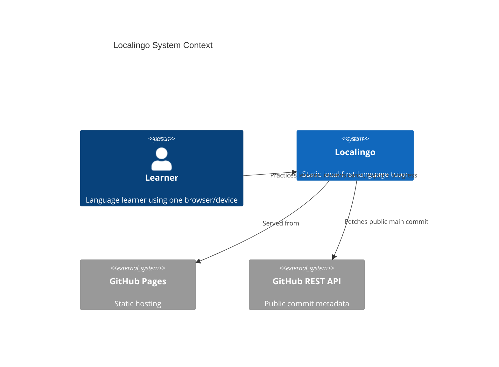
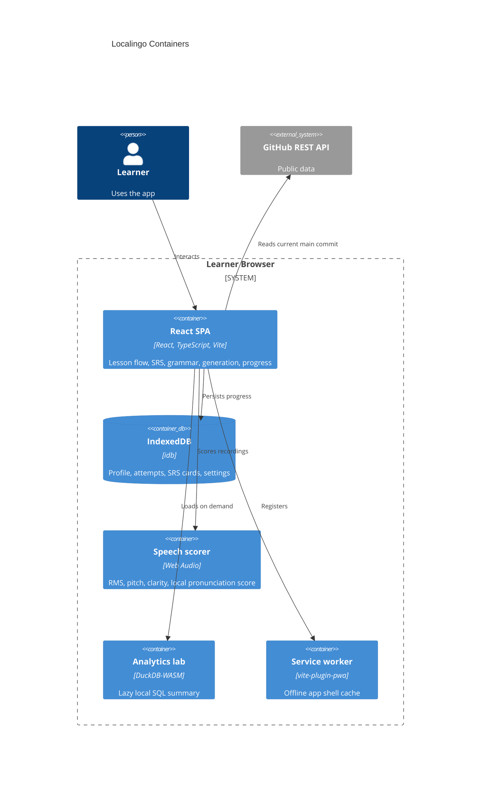

# Architecture

Localingo is a Mode A static application published from GitHub Pages.

Live site:
https://baditaflorin.github.io/localingo/

Repository:
https://github.com/baditaflorin/localingo

## Context

## Containers

## Module Boundaries

- `src/app`: shell, tabs, build metadata, error boundary.
- `src/data`: bundled seed course.
- `src/features/lesson`: lesson UI inside `App.tsx`.
- `src/features/review`: spaced repetition scheduler.
- `src/features/grammar`: answer and grammar feedback.
- `src/features/generation`: local embeddings and generated drills.
- `src/features/speech`: recording hook and pronunciation scoring.
- `src/features/analytics`: progress summaries and DuckDB-WASM lab.
- `src/lib`: storage, export/import, normalization, GitHub metadata.

## Pages Boundary

Everything under `docs/` is public. No secrets are allowed in the frontend. The app can call only unauthenticated public APIs or local browser APIs.
